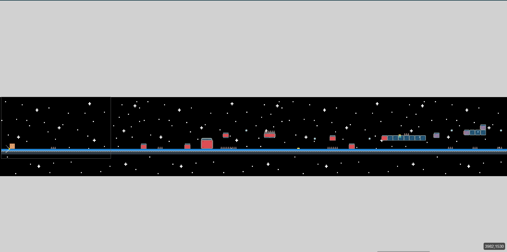

# 🗺️ Création de la map et liste des objets nécessaires pour réaliser le projet

La map de notre version de Geometry Dash sera créée en utilisant une série d'objet spécifiques.

Si tu ne sais pas comment ajouter des objets à ton jeu, tout est expliqué ici ---> [Ajouter un objet](https://github.com/g404-code-gaming/GDevelop_Cour/blob/main/Objets.md)

Voici la liste des objets dont nous aurons besoin pour réaliser le projet :

>🟩 Un personnage cubique : C'est le protagoniste de notre jeu. Il se déplace automatiquement à travers la map et le joueur contrôle ses sauts pour éviter les obstacles.
>
>🟦 Une plateforme : Ce sont les surfaces sur lesquelles notre personnage cubique se déplace. Elles sont placées à différents endroits et hauteurs pour créer le parcours que le personnage doit suivre.
>
>⬆️ Une plateforme de saut (tremplin) : Ces plateformes spéciales propulsent notre personnage cubique en l'air lorsqu'il les touche, lui permettant d'atteindre des zones plus élevées ou de sauter par-dessus des obstacles.
>
>⚠️ Des piques (pièges) : Ces objets pointus sont les principaux obstacles de notre jeu. Si le personnage cubique les touche, il meurt et le joueur doit recommencer le niveau.
>
>🟥 Un cube rouge qui représentera la zone de détection de mort : Cet objet invisible est placé à des endroits stratégiques où le personnage cubique ne devrait pas être capable d'aller. Si le personnage touche ce cube, il meurt, indiquant au joueur qu'il a fait une erreur.
>
>🚪 Une porte : C'est l'objectif final de chaque niveau. Lorsque le personnage cubique atteint la porte, le niveau est terminé et le joueur passe au niveau suivant.
>
>🌈 Une boule de couleur : Ces objets peuvent donner au joueur l'occasion de réaliser un saut bien qu'il soit déjà dans un état de saut.

Chaque objet a un rôle spécifique et contribue à la complexité et à l'amusement du jeu. En combinant ces objets de différentes manières, nous pouvons créer une variété de niveaux avec des défis uniques pour les joueurs.

Maintenant que tu as cette liste d'objets 📝, je t'encourage à essayer de créer ton propre niveau de Geometry Dash 🎮. Pense à la façon dont tu peux disposer les plateformes 🟦, les tremplins ⬆️, les pièges ⚠️ et les zones de détection de mort 🟥 pour créer un parcours intéressant et stimulant 🧩. N'oublie pas d'inclure la porte 🚪 à la fin du niveau et de parsemer des boules de couleur 🌈 pour donner aux joueurs un défi supplémentaire. Si tu as du mal à visualiser comment tout cela pourrait s'assembler, ne t'inquiète pas 😊. Je te fournirai une image 🖼️ pour te donner une idée de ce à quoi pourrait ressembler un niveau. Alors, lance-toi et laisse libre cours à ta créativité 💡 !

[Passons au déplacement de notre personnage](https://github.com/g404-code-gaming/GeometryDash_CodeGaming/blob/main/Création-Du-Jeu/02_Déplacement%20du%20personnage%20%2B%20animation.md)
