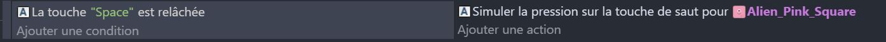

# 🏃‍♂️ Déplacement du personnage + animation : 
## Déplacement + Saut 🦘: 
### Comportement📊: 
Avant de commencer à coder le déplacement et le saut, nous devons ajoutez certains comportements. 

Ajoutez le comportement **PlateformersObject** (en français : Personnage Ce déplaçant sur des plateformes) sur votre Personnage cubique. 

Pour savoir comment ajouter un comportement, c'est par ici : ---> [comportements](https://github.com/g404-code-gaming/GDevelop_Cour/blob/main/Comportement.md).

Dans le comportement de votre personnage, désactivez les contrôles par défaut et choisissez les paramètres qui vous conviennent.

Ajoutez aussi le comportement **Plateformer** sur vos plateformes, sinon, votre personnage tombera dans le vide.

### Code 💻: 

Une fois les comportements définis, nous pouvons commencer à [coder](https://github.com/g404-code-gaming/GDevelop_Cour/blob/main/%C3%A9v%C3%A8nements.md) le déplacement et le saut. Le personnage se déplace automatiquement vers la droite ➡️, donc avons besoin de coder en ajoutant seulement une force. 

Ensuite, nous devons coder le saut. Cela peut être fait en ajoutant une force ascendante ⬆️ au personnage lorsque le joueur appuie sur la touche de saut.

Player2 correspond à un groupe d'objet qui est le Player et les particules que nous allons créer juste après.

[Maintenant, essayons de tuer notre personnage.](https://github.com/g404-code-gaming/GeometryDash_CodeGaming/blob/main/Création-Du-Jeu/03_Tuer%20notre%20personnage.md)

