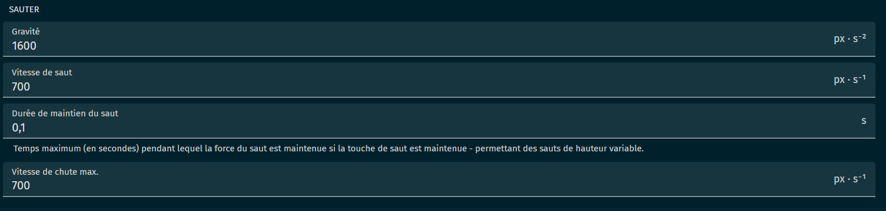
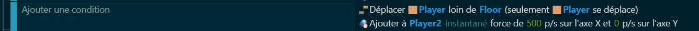
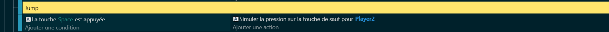
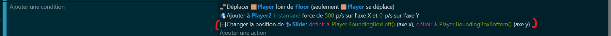
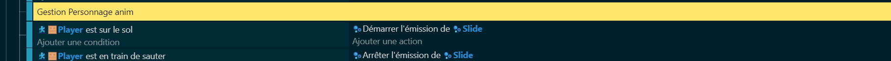
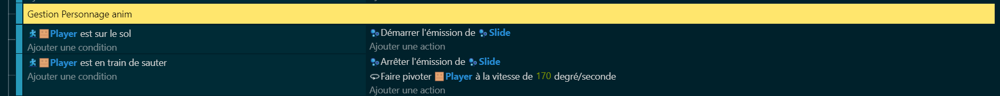
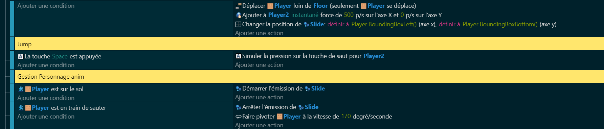

# 🏃‍♂️ Déplacement du personnage + animation : 
## Déplacement + Saut 🦘: 
### Comportement📊: 
Avant de commencer à coder le déplacement et le saut, nous devons ajoutez certains comportements. 

Ajoutez le comportement **PlateformersObject** (en français : Personnage Ce déplaçant sur des plateformes) sur votre Personnage cubique. 

Pour savoir comment ajouter un comportement, c'est par ici : ---> [comportements](https://github.com/g404-code-gaming/GDevelop_Cour/blob/main/Comportement.md).

Dans le comportement de votre personnage, désactivez les contrôles par défaut et choisissez les paramètres qui vous conviennent.

Ajoutez aussi le comportement **Plateformer** sur vos plateformes, sinon, votre personnage tombera dans le vide.

### Code 💻: 

Une fois les comportements définis, nous pouvons commencer à [coder](https://github.com/g404-code-gaming/GDevelop_Cour/blob/main/%C3%A9v%C3%A8nements.md) le déplacement et le saut. Le personnage se déplace automatiquement vers la droite ➡️, donc avons besoin de coder en ajoutant seulement une force. 

Ensuite, nous devons coder le saut. Cela peut être fait en ajoutant une force ascendante ⬆️ au personnage lorsque le joueur appuie sur la touche de saut.

Player2 correspond à un groupe d'objet qui est le Player et les particules que nous allons créer juste après.

## Animation avec ajout de particules 🎇: 

### Ajout de particules ✨:
Pour rendre le jeu plus visuellement intéressant, nous pouvons ajouter des particules qui sont émises lorsque le personnage court et saute. Ces particules peuvent ressembler à de la poussière, des étincelles, etc. Elles peuvent être créées en utilisant un émetteur de particules.

Crée un émetteur de particule puis placer le à l'arrière de notre personnage au sol.
À chaque instant, on va modifier la position pour chaque déplacement du payer.

Suite à cela, on voudrait que l'émission se réalise seulement quand le personnage est au sol. On réalisera alors un arrêt d'émission de particules lorsque le player ne sera plus détecter comme au sol.

### Animation de saut 🏃‍♂️:

Lorsque le personnage saute, une animation de saut est jouée. Ces animations donnent l'impression que le personnage saute et surtout évite de rester immobile.
Lorsque le personnage ne sera pas en contact avec le sol, on ajoutera une rotation au player.

À la fin de cette partie, vous devriez en être ici au niveau du code.

[Maintenant, essayons de tuer notre personnage.](https://github.com/g404-code-gaming/GeometryDash_CodeGaming/blob/main/Création-Du-Jeu/03_Tuer%20notre%20personnage.md)

