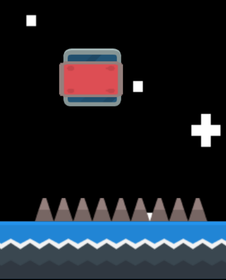

# 💀 Tuer notre personnage

Dans Geometric dash, on peut mourrir de deux manières : 
 - en touchant des piques (ou tout autre objet dangereux)
 - en touchant une deadzone

Afin de ne pas avoir à coder chacune de ces manières de mourrir, nous allons réunir tout les éléments dangereux dans un groupe d'objet. 

Créez un groupe d'objet **Danger** et placez dedans vos objets dangereux.

Créer aussi un groupe **Sol**, dans lequel vous allez mettre tout les objets sur lesquels votre personnage peut se déplacer.

## Mort du personnage 

Le personnage meurre quand il entre en collision avec un des objets du groupe **Danger**. Cela relance le niveau après 1 seconde : 

## Placement des Deadzone 📦
Les Deadzones sont des objets particuliers : ce ne sont pas des objets visibles, mais des carrés invisibles qui nous tue lorsqu'on percute un mur ou un plafond. 

Pour les placer correctement sur chacun des éléments de notre scène, nous programmons l'évènement suivant: 

Pour ne pas voir les CheckBox, on passera l'opacité de l'objet au lancement de la scène à 0.

Nous avons l'essentiel du jeu. Il reste toutefois beaucoup de chose à améliorer : [Jumpers](https://github.com/g404-code-gaming/GeometryDash_CodeGaming/blob/main/Création-Du-Jeu/04_Jumper.md)
