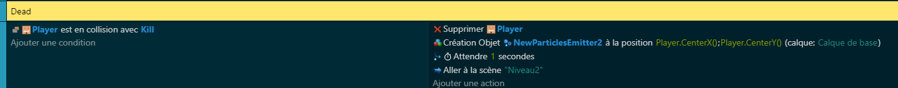

# 💀 Tuer notre personnage

## Placement des checkbox 📦
La première étape pour tuer notre personnage est de placer des checkbox sur chaque devanture des plateformes. Ces checkbox serviront de zones de détection de mort. Lorsque notre personnage cubique 🟩 entre en contact avec l'une de ces zones, il sera considéré comme mort. Il est important de placer ces checkbox de manière précise pour s'assurer que le personnage meurt seulement lorsqu'il est censé mourir (par exemple, lorsqu'il tombe dans un piège ⚠️ ou lorsqu'il touche un obstacle).
Voici un exemple en image.

## Code de la mort 💻
Une fois les checkbox placées, nous pouvons passer au [code](https://github.com/g404-code-gaming/GDevelop_Cour/blob/main/%C3%A9v%C3%A8nements.md) de la mort. Ce code sera exécuté lorsque le personnage entre en contact avec une zone de détection de mort. Il peut inclure des actions comme arrêter le mouvement du personnage, jouer une animation de mort, afficher un message de game over, etc. Le code de la mort est une partie essentielle du jeu, car il donne des conséquences aux erreurs du joueur et ajoute un élément de défi au jeu.

Pour ne pas voir les CheckBox, on passera l'opacité de l'objet au lancement de la scène à 0.

Pour ma part lorsque le player mourra je créerais des particules rouges en supprimant notre player et en rechargeant la scène de jeu.

[Ajoutons a notre map des jumpers](https://github.com/g404-code-gaming/GeometryDash_CodeGaming/blob/main/Création-Du-Jeu/04_Jumper.md)
