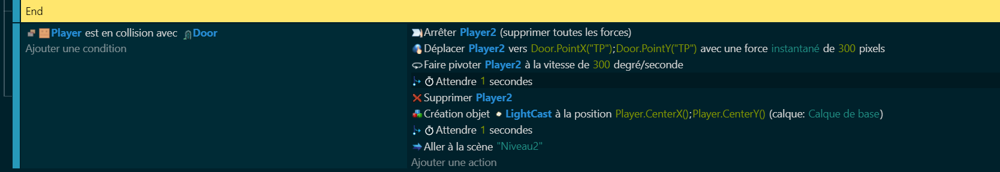

# 🏁 Fin du parcours

La fin du parcours est un élément crucial de tout niveau de Geometry Dash. C'est l'objectif que le joueur essaie d'atteindre, et c'est ce qui marque la fin du défi.

## Placement de la porte 🚪

La fin du parcours est généralement marquée par une porte ou un autre objet de fin de niveau. Cette porte doit être placée à un endroit qui ne peut être atteint que si le joueur a réussi à naviguer à travers tous les obstacles du niveau.

## Code de fin de niveau 💻

Lorsque le personnage atteint la porte, nous devons exécuter un certain code pour marquer la fin du niveau. Cela pourrait inclure l'arrêt du mouvement du personnage, la lecture d'une animation de fin de niveau, l'affichage d'un écran de victoire, etc.

(le code est impressionnant, mais il est surtout composé de ligne dédiée a l'animation si vous ne voulez pas d'animation, vous avez juste à réaliser la dernière ligne de code)

Félicitations ! 🎉 Tu as réussi à créer ton propre Geometry Dash ! 🎮 C'est une réalisation impressionnante. Tu as pris un concept de jeu populaire et tu l'as fait tien, en utilisant tes compétences en codage et en design. 

Maintenant, c'est à toi de jouer ! 🕹️ Tu as les bases, mais il y a encore tant de possibilités. Pourquoi ne pas ajouter de nouvelles mécaniques de jeu ? Des power-ups, des ennemis, des niveaux secrets... Laisse libre cours à ta créativité et fais de ce Geometry Dash quelque chose d'unique.

Tu devrais être fier de ce que tu as accompli. Continue à explorer, à apprendre et à créer. Qui sait quel jeu incroyable tu vas créer ensuite ? Bravo à toi ! 👏
